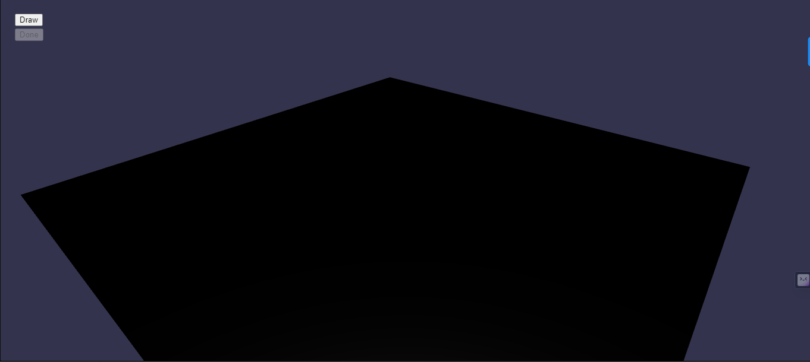
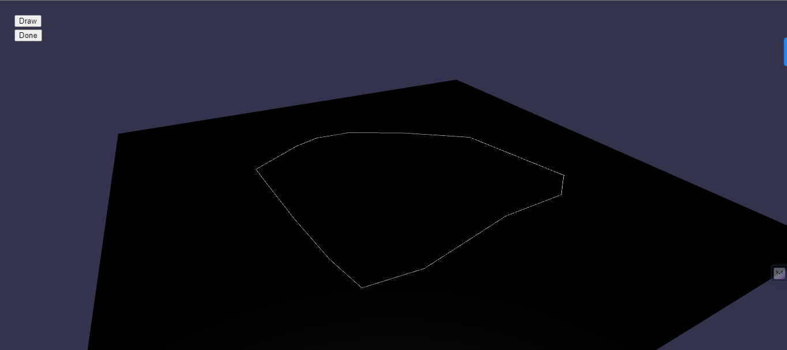

# Babylon.js 2D Shape Extrusion and Manipulation

## Task Assigned
The goal of this assignment is to create a Babylon.js application that allows the user to draw arbitrary 2D shapes on the ground plane, extrude them into 3D objects with a fixed height, and then manipulate those objects by moving the object and editing their vertices using buttons for mode selection.

## Requirements
- Use Babylon.js to create a 3D scene with a ground plane.
- Implement functionality to allow the user to draw 2D shapes on the ground plane using mouse interactions (e.g., left-click to add points, right-click to complete the shape). Provide a "Draw" button to enter the draw mode.
- Once the shape is completed (a closed loop), provide a UI element (e.g., button) to initiate the extrusion process. The extrusion height can be a fixed hard-coded value.
- Allow the user to move the extruded objects on the ground plane using mouse interactions (e.g., click and drag). Provide a "Move" button to enter move mode.
- Implement functionality to edit the vertices of the extruded object using mouse interactions (e.g., click and drag to move vertices). Provide a "Vertex Edit" button to enter vertex edit mode.
- Provide visual cues and UI elements to indicate the selected object and active editing mode (move or edit vertices).

## Implementation Overview
#### Key Steps
- <b>Library Import:</b> Import the 'Babylon.js' library for 3D graphics.
- <b>Canvas Setup:</b> Prepare an HTML canvas element to render the 3D scene.
- <b>Engine Initialization:</b> Create a game engine connected to the canvas with WebGL enabled.
- <b>Scene Creation:</b> Set up a 3D scene for placing objects.
- <b>Camera Setup:</b> Add a camera for viewpoint control and enable user interaction.
- <b>Lighting:</b> Introduce a light source for scene illumination.
- <b>Ground Creation:</b> Create a ground surface and customize its appearance.
- <b>Drawing and Extrusion:</b> Enable users to draw lines on the ground, update them in real-time, and extrude them into 3D shapes.
- <b>Continuous Rendering:</b> Ensure the 3D scene is continuously updated and displayed.
- <b>Window Resizing:</b> Implement resizing for the canvas to adapt to the window size.

#### Helper Functions
- ```createLineMesh```: Create lines by connecting points.
- ```extrudeLinesTo3D```: Extrude lines to form 3D shapes.

## Technology Used
- <b>Babylon.js:</b> For 3D rendering and interaction.
- <b>Vite:</b> A build tool for faster development and efficient asset bundling.
- <b>HTML:</b> For structuring the web-based interface.
- <b>JavaScript:</b> For interactivity, enabling line drawing and 3D shape extrusion.

## Results



During the development of the project, several significant achievements and challenges were encountered:

- **Accomplished Milestones**: The project successfully achieved the creation of a 3D scene with a ground plane using Babylon.js, implemented the basics of drawing objects with a rotating arc camera, and incorporated other essential features. This initial progress forms the foundation for the project's core functionality.

## Challenges

While working on the project, several challenges were encountered:

- **Drawing Functionality**: Implementing the functionality to allow the user to draw 2D shapes on the ground plane using mouse interactions, especially the process of joining dots on left-click and creating a closed loop on right-click, posed a substantial challenge. Developing an intuitive and responsive drawing mechanism required careful consideration.

- **Object Movement**: Enabling the user to move the extruded objects on the ground plane using mouse interactions presented its difficulties. Providing a smooth and intuitive object manipulation experience was a complex task, as it involved interaction with a 3D environment.

- **Vertex Editing**: Creating functionality to edit the vertices of the extruded object using mouse interactions was another significant challenge. Precise vertex editing in a 3D environment demanded careful handling of user interactions and visual feedback.

## Future Improvements

To enhance the project and achieve its full potential, the following future improvements are planned:

- **Advanced Drawing**: Implement advanced drawing functionality that allows users to create various 2D shapes with ease, adding more options and flexibility to the drawing process.

- **Enhanced Object Manipulation**: Improve the user experience by enhancing the object movement functionality. Provide advanced controls and feedback to ensure seamless manipulation of extruded objects within the 3D scene.

- **Vertex Editing Tools**: Develop a comprehensive set of tools for editing the vertices of extruded objects, enabling users to precisely modify the shape and appearance of 3D objects with ease.

These future improvements aim to take the project to its completion, offering a feature-rich and user-friendly 3D shape creation and manipulation experience using Babylon.js.

## Getting Started
To get started with the project, follow these simple steps:

###### Clone the repository to your local machine:
 ```git clone```: https://github.com/sankalp20/Babylon.js-2D-Shape-Extrusion-and-Manipulation.git

###### Install dependencies:
- ```cd Babylon.js-2D-Shape-Extrusion-and-Manipulation```
- ```npm install```
- ```npm run dev```

## Contact
Have questions or feedback? Feel free to reach out to me at sankalpforwork@gmail.com.
